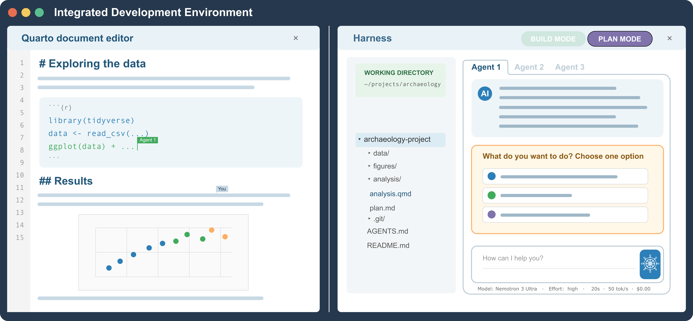
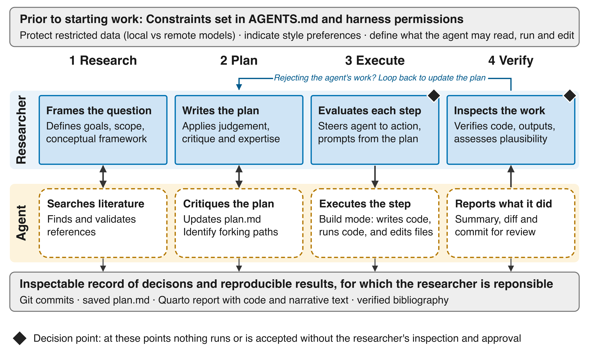

# Introduction

Archaeologists who use generative artificial intelligence (AI) to assist with their work face a practical question: how to use these tools in a responsible and productive way? We define artificial intelligence as software that perform tasks associated with human intelligence, including communication, decision-making, and prediction [@GildeZuniga2024]. Generative AI uses patterns learned from training data to produce text, code, images, or other content [@Feuerriegel2024]. For the majority of archaeologists, the most commonly used generative AI tools are large language models (LLMs), such as ChatGPT and Claude, that we interact with via a web-based chat interface. While these models often generate useful content, outputs can also include hallucinations (content presented as factual without an adequate basis), invented citations [@Walters2023] and convincing-sounding incorrect explanations [@Leung2023; @Messeri2024]. Financial, environmental, and energy costs, commercial dependence, copyright, privacy, bias, and data sovereignty also concern archaeologists using commercial LLM services [@Kansa2026; @Tenzer2024; @Bischoff2026LargeLanguageModels; @JohnsonEberl2026; @Gattiglia2025]. AI currently has a jagged frontier, meaning that AI assistance improves performance on certain tasks but degrades quality on others of seemingly identical difficulty [@DellAcqua2026]. This makes it hard to predict when an AI will produce high-quality output, and necessitates fine-grained human oversight. That said, a study of over 600 scientists, including archaeologists, found that 47% of researchers use some form of AI daily, saving on average 7 hours per week [@Codreanu2026]. To support responsible and time-saving uses of AI by archaeologists, we introduce a basic agentic AI workflow using open source software that is suitable for many kinds of archaeological work. While traditional AI chatbots engage with humans in the form of turn-by-turn conversations on a website that require regular human interaction to complete a task, agents are a very different way to interact with AI. An AI agent can autonomously operate tools directly on our computer to complete multiple steps towards a specific goal without constant human interaction. This article describes how to use agentic AI to reduce the friction associated with many of the typical tasks of the archaeological research process that are done on a computer.

Agentic AI refers to systems in which a LLM uses context (e.g. files on our computer), skills (e.g. specific instructions we want it to follow for specific tasks) and tools (e.g. the R programming language) to plan and take actions (e.g. search the internet, edit our files), rather than only responding to a prompt like a web-based chat [@Korinek2025]. An AI agent connects a LLM to pre-defined instructions and tools that can read files, execute code, or retrieve information. Agents autonomously operate LLMs and various computer tools to pursue a specific goal without the constant human interaction required by a web-based chat . A wide variety of agentic systems have emerged recently, @tbl-taxonomies summarises these by increasing autonomy [@Haase2026; @Zimmer2026]. Our guide focuses on the low-autonomy end of that range: the agent works only within a single project and you direct each stage. We are not describing end-to-end fully automated AI pipelines that generate ideas, run experiments and write manuscripts with limited human intervention [e.g. @Lu2026]. Instead, we describe how to set up an AI assistant for routine research tasks typical of academic, government or CRM archaeologists, where file access, code execution, and outputs remain subject to your evaluation and approval.

```{r}
#| label: tbl-taxonomies
#| tbl-cap: "Levels of agentic AI in two recent taxonomies."
#| echo: false
knitr::kable(read.csv(here::here("analysis", "figures", "table-taxonomies.csv")), col.names = c("Level", "Haase et al. (2026)", "Zimmer et al. (2026)"))
```

In this researcher-directed workflow, we follow the "human at the helm" approach to describe responsibility for setting goals, approving methods, interpreting findings, and deciding what to publish [@Monakhov2026; @Jonker2024]. This can be contrasted with human-in-the-loop approaches where human intervention is mostly as a validator rather than decision-maker [@Zanzotto2019; @Taylor2023]. @tbl-helm-vs-loop compares the two approaches. With the human at the helm, control requires observable actions: the researcher reviews changes, checks evidence, and can stop or redirect the work. 

A high level of researcher control also necessary to honor our responsibilities toward the communities involved in our work and affected by it. AI-generated perspectives cannot replace community participation [@Spillias2025]. Where archaeological work requires community consultation or consent, our approval of an agent's actions does not replace those obligations. Recent guidance on archaeological AI ethics and heritage management provides additional reasons to make those responsibilities explicit [@Tenzer2024; @Shaikhon2025].

```{r}
#| label: tbl-helm-vs-loop
#| tbl-cap: "Human in the loop versus human at the helm across eleven dimensions."
#| echo: false
knitr::kable(read.csv(here::here("analysis", "figures", "table-helm-vs-loop.csv")))
```

We translate these responsibilities into three practices for using agentic AI in archaeological work. First, develop enough familiarity with research tools and standards to evaluate the quality of AI-generated outputs. Second, configure an AI agent in a local harness to work with your project files under researcher-defined permissions. Third, use tools, skills, and Model Context Protocol (MCP) servers to research, plan, execute, and verify data analyses. These practices will be most useful to archaeologists who already analyze their own data with an open source scientific scripting language such as R (or Python), whether in academia, government, or private practice, and are looking to reduce some of the friction and repetition in their current workflow. 

# Step 1: Learn the Research Tools and Standards {#sec-tools}

We recommend learning to import, analyse and visualise data with a scripting language such as R or Python before involving an agent in an analysis; computational literacy must be a core methodological competence for data-intensive researchers [@Cooper2024]. You need to be able inspect agent-generated code and explain its relationship to your archaeological question. Learning these fundamentals provides a basis for evaluating the quality and relevance of AI suggestions [@Dyck2026; @Bridgeford2026]. Our view reflects the current consensus in many fields that learning coding fundamentals and thinking critically about generated code remains essential despite the expanding availability of AI assistance [@Campbell2024; @Dyck2026; @Abramson2026; @Nejjar2025]. 

We recommend choosing a small set of reputable tools widely used for reproducible research [@Marwick2017], and learning how they work together, for example, for R users the tidyverse for data preparation and ggplot2 for visualization [@Wickham2019]. The here package helps construct project-relative file paths, and the renv records R package dependencies. The Quarto document format is ideal for writing your report, this combines prose and executable code in a document written as a plain-text `.qmd` file [@QuartoDocs2026]. Quarto is an extension of the Markdown document format, which LLMs read and write very efficiently and accurately, much more so than Word documents and PDFs. We recommend using converters, such as Markitdown, to turn DOCX and PDF files into markdown so agents can efficiently read them. Documents that you want your agent to read and edit should be in Markdown format to improve the agent's efficiency. 

Git is another free and open source software that specializes in collaboration and recording versions of project files (e.g. text, code, data) so you can inspect changes and retrieve earlier work [@Wilson2014]. Agents are fluent in Git and efficient at using it to track changes over multiple files in a project. The toolkit we have sketched out here, centered on R, Markdown, and Git, is especially well-suited for working with AI agents because it gives the agent and the researcher a shared, inspectable medium using free and open source tools. Agents read Markdown instruction files, run the R code embedded in our Quarto documents, and their edits are traceable as Git commits. This is a robust system for linking reported results back to the executable analyses that generated them; every machine-generated change is recorded transparently in plain text for you to review before accepting or rejecting it.

# Step 2: Configure an Agent Harness for Your Project {#sec-harness}

When we use the tools described in @sec-tools, it is relatively simple to configure an AI agent so that it can efficiently see all the files in our project and edit them directly. The key tool here is a local harness, this is software you install on your computer that turns a LLM into an agent. The LLM by itself can only generate text, and the harness connects that model to tools, such as reading and editing project files, running shell and R commands, calling MCP servers, and managing the exchange between the model, the tools, and you. The harness enforces permissions, and manages context, runs loops, and presents the interface (@tbl-harness). At the time of writing widely used harnesses include Claude Code, GitHub Copilot, OpenAI Codex and OpenCode. We recommend the OpenCode terminal user interface (running in the terminal pane of an integrated development environment such as RStudio or VS Code) because it is free, open source, and not tied to any model vendor [@fig-agent-in-ide].

```{r}
#| label: tbl-harness
#| tbl-cap: "Four parts of an agent harness and what each one does."
#| echo: false
knitr::kable(read.csv(here::here("analysis", "figures", "table-harness.csv")))
```

{#fig-agent-in-ide}

Store preferences and working habits you reuse across projects in a global AGENTS.md file. In OpenCode this file is located in a path similar to .config/opencode/AGENTS.md. Keep project-specific details in a second AGENTS.md file located at the top level of each project folder. This project-specific preferences file is the place to record contextual information specific to the project you are currently working on, and saves you having to manually send those details to the LLM in each session. This could include information about archaeological context, about prior decisions you have made about the analysis plan, about your target audience for your report or manuscript, etc. We provide examples of our AGENTS.md files in our research compendium.

Harnesses often provide multiple working modes, for example, 'plan' and 'build'. Plan directs the model to inspect files and propose changes without editing any project files. Build allows file editing and running code according to your permission settings. We recommend using Plan mode when exploring options with the model and drafting your analysis plans. This prevents the model from making changes to your files before your plan is finalized. Multiple rounds of planning are necessary for a high quality plan [@Messeri2024; @Bertran2026], giving you a chance to steer and challenge the model, request justification for decisions it proposes, and invite the model to criticize your ideas, in anticipation of human reviewers [@Korinek2023]. This helps to surface forking paths (alternative analytical decisions that could lead to different conclusions) early and map out the analysis space available to your project. Each discussion round needs evaluation against data, literature, and your expertise, letting you add variables, design details, and constraints missing from previous rounds [@Brown2026b]. Save your analysis plan to a markdown file at the end of a planning session (switch to build mode to allow the model to create a new file). Then when you resume your work, start a new conversation by directing the model to read your plan saved in the markdown file, rather than rely on its memory. This avoids the problems of models performing increasingly poorly across long meandering threads and failing to recover after a wrong turn [@Laban2025]. Having your plan in a markdown file also allows you to easily directly edit it independent of the AI, and manually record the status of each step of the plan (e.g. 'done', 'in progress'), so you remain at the helm of your project.

Planning an analysis with a LLM can be effective when using a state-of-the-art, reasoning-enabled large frontier model because these are often better at the long-horizon, open-ended, branching tasks involved in drafting a plan [@Zhang2025; @Lu2026]. However, larger models can be slower, more expensive and resource intensive, so we recommend switching to a smaller model to implement the individual steps of the plan. When your plan is set, switch your harness to build mode and direct the model to execute one step of the plan. As the model completes a step, verify completion by inspecting the Git diff, check the output against your plan, and for more complex steps, interrogate the model to have it justify its actions. Agents sometimes report finished work they never completed [@Brown2026a; @Nejjar2025], so it is essential check the files and outputs yourself.

While the harness is installed and runs locally on our computer, they typically use LLMs hosted remotely at data centers. This connection requires obtaining an API (Application Programming Interface) key from a model provider, and adding this key to our harness configuration file. Once we have this connection, our file contents and tool outputs may enter the context sent to a remote model, and potentially even be used to train future LLMs. For many archaeological projects this is unacceptable, e.g. when working with confidential client information, and culturally sensitive data. @tbl-privacy summarises common solutions to this problem. 

```{r}
#| label: tbl-privacy
#| tbl-cap: "Options for protecting restricted data when the model runs remotely."
#| echo: false
knitr::kable(read.csv(here::here("analysis", "figures", "table-privacy.csv")))
```

# Step 3: Use Tools, Skills, and Model Context Protocols to Research, Plan, and Analyze {#sec-analysis}

With the harness configured, working with an AI to generate plans and analyse data is more efficient by using tools, skills and Model Context Protocols (MCPs) to do common research tasks such as search for and verify references, write and run code, organise and manage files, and simulate peer review. A tool performs a single computer action and returns a result, such as reading, editing and renaming a file, or starting R and running R code. A skill is a simple markdown file of metadata and instructions and supporting resources for a recurring task [@Xu2026]. The agent reads the full skill file when a task contains words that matches the metadata, and the skill file contents is sent to the model as part of the prompt. For example, we have a skill file for the tidyverse idiom of the R language. When we ask for R code, the harness loads that file into the context and sends it to the model along with the rest of the prompt, and the output follows those conventions. MCP is an open source standard for connecting an agent to external data sources and services; they can also provide specialist tools [@Hou2025]. A skill describes a procedure, while tools perform its actions and an MCP server supplies connections. @tbl-stack lists the MCP servers and skills named in this guide plus the instructions files that govern them. These are open formats so you can work with your agent to write new skills and MCP servers to meet the needs of your specific project.

```{r}
#| label: tbl-stack
#| tbl-cap: "MCP servers and skills installed in the author's OpenCode configuration. Readers can copy-paste this table into their AI agent and ask it to install them for global availability."
#| echo: false
knitr::kable(read.csv(here::here("analysis", "figures", "table-stack.csv")))
```

As as example of how these additions work, consider what happens if we give our agent the command "deeply research the debates about the peopling of the Americas". This will load the deep-research *skill*, whose trigger keywords include that phrase. This specific skill contains instructions that causes the harness to dispatch multiple agents for search, verification, and synthesis. Retrieval *tools* fetch scholarly papers while verification tools check each citation against publication databases through a reference-verification server. The literature search and verification tools are provided by the refcheck MCP server; they query Crossref and Semantic Scholar. The agent can then write the results of the literature search into your project-level bibtex file or to your Zotero library for reuse across multiple projects. Skills guides the agent but cannot force compliance, so you need to review the completeness and accuracy of results before incorporating them into your work. We recommend multiple iterations of literature search prompts, adjusting the prompt each time to the steer the model to focus on different areas of the literature [@Moorthy2026]. Multiple rounds of verification are also important to ensure the bibliography is free of hallucinated details.

Aided by tools, skills and MCP servers, you can direct AI agents to very efficiently and accurately extract data from the full text of publications and archival records [@Cootsona_Castillo_Sunseri_2026; @Hariri2025; @Scheepens2024]. One LLM extracted ecological data from literature 50 times faster than a human reviewer, with accuracy above 90% on discrete and categorical data [@Gougherty2024]. Human validation is necessary: @Ziems2024 recorded uneven validity across social concepts, and @Gougherty2024 observed that AI performed poorly on certain quantitative data. Context-rich prompting improves data extraction results [@Moorthy2026], though no single model dominates all extraction tasks, so you should test several model-prompt pairings. Before using machine-coded variables, you should define them in detail, compare a AI-collected sample against human coding, and document errors. 
Although writing code from plain English prompts is perhaps the single greatest strength of most LLMs [@Zheng2024], generating high-quality, real-world code for research still requires your understanding of your project's context, debugging skills, and integration with the overall goals of your research project. When using an AI agent to plan and write code for data analysis, we recommend you: 

1. Write a prompt that is detailed and specific about the study's context, research question, types of variables and data collection methods [@Brown2026b]. The archaeological expertise you bring to writing this prompt can make a big difference to the quality and consistency of responses to your prompts [@ZamfirescuPereira2023]. Rich context minimizes ambiguity and helps to aligns the model with your goals.
2. Include with the prompt the dataset, a narrative summary of the data or a synthetic version of the data generated by a local LLM. This is another form of context and will improve the quality of the model's output [@Jansen2025]. 
3. Include high-quality trustworthy reference materials, such as the names of widely used R packages relevant to your work, DOIs to exemplary studies similar to what you want to do, or technical methodological literature that describes relevant methods and best practices in detail [@Brown2026b]. Use the agent's tools to help you get this literature.
4. Include instructions for the model to evaluate its code for correctness and completeness before stopping. This sets the agent to work in a loop: generate code -> run it -> test it -> fix any errors -> run it again -> test it, etc. until your evaluation criteria have been satisfied. Specifying evaluation criteria and instructing the model to debug itself improves the accuracy of output [@Chen2023]

Tools that execute code can expose errors for inspection, but automated correction still needs review. @Brown2026a tested agentic workflows for ecological and fisheries modelling and found variable accuracy and failures to follow instructions. When code fails, check whether the proposed correction preserves the method you planned to use. Do not accept a different analysis simply because it runs. Agents also change methods without flagging it, for example, @Brown2026a found that one agent swapped a requested bootstrap interval for a t-distribution interval, so it is necessary for you to read the code generated by the agent, not just its summary.

# Discussion and Conclusion

The three practices described here assign distinct responsibilities to you as the researcher. Familiarity with R, Quarto, and Git supports efficient and transparent interaction with AI agents, supporting your inspection of calculations, reports, and changes. Harness configuration allows you to define the AI agent's permissions and work habits to manage privacy, bias, and data sovereignty concerns. Use of tools, skills, and MCP servers expands the capability of the model, and improves the accuracy and usefulness of its work. This sequence is a natural extension of existing scientific-computing best practices to agent-assisted archaeological work [@Marwick2017; @Bridgeford2026]. Our practices draw on norms emerging from the broad adoption of AI in science, and the broad consensus across diverse research communities that AI should be used appropriately and transparently as a tool that requires expert humans to judge, verify, and take responsibility for the outputs [@Codreanu2026; @RoyalSociety2024; @NationalAcademies2026].

{#fig-workflow}

The paper's specific contribution is an auditable, researcher-directed workflow for AI-assisted archaeological data analysis [@fig-workflow]. It links archaeological competence, project-level permissions, and checkable agent actions in a project so that the plan, code, source records, and rendered report remain available for review. The advance in this paper comes from the integration of recently developed agentic AI technologies into a three-practice structure for responsible archaeological analysis. Our three practices address a key issue surrounding the adoption of LLMs by archaeologists, namely the integration of AI tools into existing workflows [@CardarelliRagno2026].

Although agentic AI has potential to make research work more efficient, it has some limitations and failure points. It can fail to follow instructions, and its scientific reasoning can be flawed [@Brown2026a]. Furthermore, there is some setup up time required to install and configure agentic software, and working with restricted archaeological data requires local-only, non-remote configurations that requires some expertise. Unskilled use of AI can result in it generating plans for analyses that statistically invalid or have low statistical power [@Brown2026a; @Campbell2024]. A key implication here is that we need to teach basic AI literacy in undergraduate curricula in archaeology, alongside statistical literacy and research design [@CardarelliRagno2026]. This will ensure that future archaeologists are well-equipped to responsibly and effectively use AI in their professional work.

The adoption of agentic AI into archaeological research processes may change more than just the speed of work. Recent social science scholarship increasingly treats generative AI as a sociotechnical and epistemic force that is reconfiguring research design, evidence production and evaluation, methodologies, authorship, and researcher reflexivity [@Abramson2026; @Longkumer2025Generative; @Bail2024Generative; @Grossmann2023Transformation]. @Piper2026 argues that AI is "better understood as a methodological environment that changes the conditions under which research questions are formed, constructs are operationalized, evidence is evaluated, and theories are revised." If archaeology might be similarly transformed, then we urgently need to prepare our students to manage the epistemic risks of heightened vulnerability to illusions of explanatory depth, exploratory breadth, and objectivity that come with using AI [@Messeri2024]. 

In reducing the time needed for routine and repetitive tasks, AI enables us to scale up analytic exploration [@Miao2026], and reduces the technical and cognitive burdens of testing whether our substantive claims remain stable across different combinations of assumptions, models, covariates, and parameter settings [@Piper2026; @Kim2026Power]. Working with AI, we can implement sensitivity, robustness, and power tests that have been too resource-intensive and impractical in the past. This can help us in the search for claims that robustly persist across different measurement choices, and reduce our vulnerability to selective reporting and cherry-picking [@Bertran2026]. The workflow presented here points toward a future of more credible and defensible research in which archaeologists combine open source software, coput tools, skills, and MCP servers to turn AI from an opaque oracle into an auditable research assistant, while protecting data sovereignty and keeping plans, code, sources, and final decisions under researcher control.

# Acknowledgments

No permits were required for the preparation of this manuscript. The author used OpenCode (https://opencode.ai/), an open-source AI harness, and OpenRouter (https://openrouter.ai/) a commercial model provider. AI models used included Nemotron 3.5 Ultra (NVIDIA), Qwen3.8, Muse Spark 1.3 (Meta), GLM-5.3 Flash (Zhipu), and MiMo-V2.5 (Xiaomi). These are all open-weight and open-source models. They were free via openrouter at the time of writing. AI was used to assist with searching for literature, planning, drafting and editing the manuscript and figures, and reference checking. All AI-generated suggestions were reviewed and revised by the author.

# Funding Statement

This research received no specific grant funding from any funding agency, commercial or not-for-profit sectors.

# Data Availability Statement

No original data were used.

# Competing Interests

The author declares none.

# References

::: {#refs}
:::

\newpage

### Colophon

This report was generated on `r Sys.time()` using the following computational environment and dependencies:

```{r}
#| label: colophon
#| cache: false

# which R packages and versions?
if ("devtools" %in% installed.packages()) devtools::session_info()
```

The current Git commit details are:

```{r}
# what commit is this file at? 
if ("git2r" %in% installed.packages() & git2r::in_repository(path = ".")) git2r::repository(here::here())  
```
